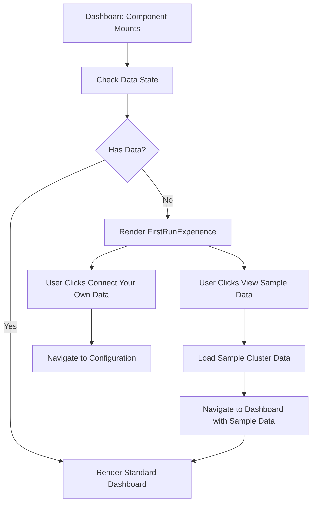

# Design Document: First Run Experience

## Overview

The First Run Experience feature provides a guided onboarding interface that replaces the empty dashboard state when users have no configured data. Instead of showing an empty dashboard with no metrics or trends, users see a purposeful page that explains the product, demonstrates value through sample data, and guides them through the core workflow loop (Trace → Evaluate → Improve).

This design integrates the existing WorkflowNavigator component into a new FirstRunExperience component and implements conditional rendering logic in the Dashboard component based on data state detection.

## Implementation Status

**Completed Improvements (Phase 1)**:
- ✅ Improved Information Architecture with two-button CTA layout
- ✅ OpenSearch logo integration (dark/light mode variants)
- ✅ Shortened card titles ("The Workflow", "Key Features")
- ✅ Removed tagline and divider line
- ✅ Corrected workflow icons (Activity, Gauge, TrendingUp)
- ✅ U-shaped return arrow for continuous feedback loop visualization
- ✅ Updated feedback loop description
- ✅ Agent Traces error message improvement (connection guidance instead of error)

## Architecture

### Component Hierarchy

```
Dashboard (Modified)
├── Data State Detection Logic
├── Conditional Rendering:
│   ├── FirstRunExperience (New - shown when no data)
│   │   ├── Hero Section
│   │   ├── WorkflowNavigator (Reused, modified)
│   │   ├── Sample Data Explanation
│   │   └── CTAs (View Sample Data, Connect Your Own Data)
│   └── Standard Dashboard (Existing - shown when data exists)
│       ├── Performance Trends Chart
│       ├── WorkflowNavigator (Existing)
│       └── Metrics Table
```

### Data Flow



## Components and Interfaces

### 1. Data State Detection

**Purpose**: Determine whether the user has configured any data (clusters, benchmarks, or traces).

**Interface**:
```typescript
interface DataState {
  hasBenchmarks: boolean;
  hasReports: boolean;
  hasData: boolean; // Computed: hasBenchmarks && hasReports
}

function useDataState(): {
  dataState: DataState;
  isLoading: boolean;
}
```

**Implementation Strategy**:
- Check if any benchmarks exist using `asyncExperimentStorage.getAll()`
- Check if any reports exist using `asyncRunStorage.getAllReports()`
- Consider data present if benchmarks exist AND at least one benchmark has runs
- This matches the existing logic in Dashboard.tsx: `hasData = benchmarks.length > 0 && benchmarks.some(b => b.runs && b.runs.length > 0)`

### 2. FirstRunExperience Component

**Purpose**: Display the guided onboarding page for users with no data.

**Interface**:
```typescript
interface FirstRunExperienceProps {
  // No props needed - component is self-contained
}

export const FirstRunExperience: React.FC<FirstRunExperienceProps>;
```

**Structure**:
```typescript
<div className="first-run-container">
  {/* Hero Section with OpenSearch Logo */}
  <section className="hero">
    
    
    <h1>Welcome to Agent Health</h1>
    <p>Make your AI agents measurable, reliable, and production-ready.</p>
    
    {/* Two-button CTA layout */}
    <div className="cta-buttons">
      <Button variant="gradient" onClick={navigateToSettings}>
        Configure Your Cluster
      </Button>
      <Button variant="outline" onClick={handleViewSampleData}>
        <Zap /> Explore with Sample Data
      </Button>
    </div>
    <p className="helper-text">
      Explore a fully configured environment with real traces and benchmarks.
    </p>
  </section>

  {/* Two-Card Layout */}
  <div className="cards-grid">
    {/* Left Card: The Workflow */}
    <Card>
      <h2>The Workflow</h2>
      <p>A continuous cycle that drives measurable improvement:</p>
      
      {/* Workflow Icons with U-shaped return arrow */}
      <div className="workflow-icons">
        <Activity /> → <Gauge /> → <TrendingUp />
        {/* U-shaped dashed arrow below */}
        <svg className="return-arrow">...</svg>
      </div>
      
      <ul>
        <li><Activity /> Trace: See exactly what your agent did.</li>
        <li><Gauge /> Evaluate: Measure quality, cost, and performance.</li>
        <li><TrendingUp /> Improve: Prevent regressions with structured test cases.</li>
      </ul>
    </Card>

    {/* Right Card: Key Features */}
    <Card>
      <h2>Key Features</h2>
      <p>Explore a fully-configured environment with real benchmarks and traces</p>
      
      <ul>
        <li><CheckCircle2 /> Performance Trends: Pass rate, latency, and cost over time.</li>
        <li><CheckCircle2 /> Benchmark Results: Side-by-side evaluation across agents.</li>
        <li><CheckCircle2 /> Trace Diagnostics: Step-by-step execution visibility.</li>
      </ul>
      
      <Link to="/settings/clusters">Configure your cluster</Link>
    </Card>
  </div>
</div>
```

### 3. WorkflowNavigatorFirstRun Component

**Purpose**: Reuse WorkflowNavigator content but adapt it for the first-run context.

**Differences from Standard WorkflowNavigator**:
- Remove "Don't show again" functionality (not applicable for first-run)
- Remove localStorage persistence logic
- Adjust CTAs to be more exploratory ("Explore Benchmarks", "Explore Traces")
- Always visible (no hide/show state)

**Interface**:
```typescript
interface WorkflowNavigatorFirstRunProps {
  // No props needed
}

export const WorkflowNavigatorFirstRun: React.FC<WorkflowNavigatorFirstRunProps>;
```

### 4. Modified Dashboard Component

**Purpose**: Conditionally render FirstRunExperience or standard dashboard based on data state.

**Changes**:
```typescript
export const Dashboard: React.FC = () => {
  const { dataState, isLoading: isCheckingData } = useDataState();
  
  // ... existing state and effects ...

  if (isCheckingData) {
    return <DashboardSkeleton />;
  }

  if (!dataState.hasData) {
    return <FirstRunExperience />;
  }

  // Existing dashboard rendering
  return (
    <div className="dashboard">
      {/* ... existing dashboard content ... */}
    </div>
  );
};
```

### 5. Sample Data Loading

**Purpose**: Load pre-configured sample data when user clicks "View Sample Data".

**Interface**:
```typescript
interface SampleDataConfig {
  clusterId: string;
  clusterName: string;
  description: string;
}

const SAMPLE_DATA_CONFIG: SampleDataConfig = {
  clusterId: 'internal-trial-cluster',
  clusterName: 'Sample Agent Benchmarks',
  description: 'Pre-configured benchmarks and traces for exploration'
};

async function loadSampleData(): Promise<void>;
```

**Implementation Strategy**:
- Store sample cluster ID as a configuration constant
- When "View Sample Data" is clicked, set the active cluster to the sample cluster
- Navigate to dashboard (which will now show data)
- Future: Replace with public-facing dataset by updating the configuration constant

## Data Models

### Visual Design Improvements

**Logo Integration**:
- Dark mode: `opensearch-logo-dark.svg` with original OpenSearch colors (#00A3E0, #B9D9EB)
- Light mode: `opensearch-logo-light.svg` with adjusted colors (#005EB8, #7FB3D5)
- Size: 64x64px (w-16 h-16)
- Automatic theme switching via Tailwind dark mode classes

**Button Layout**:
- Primary CTA: "Configure Your Cluster" (gradient: blue-600 to purple-600)
- Secondary CTA: "Explore with Sample Data" (outline variant, positioned to the right)
- Both buttons use size="lg" for prominence
- Horizontal layout with gap-3 spacing

**Card Titles**:
- Left card: "The Workflow" (shortened from "Optimize with Confidence")
- Right card: "Key Features" (shortened from "What You'll See")
- Removed italic tagline "Turn insight into reliable releases."

**Workflow Icons**:
- Trace: Activity icon (heartbeat/pulse pattern)
- Evaluate: Gauge icon (measurement/metrics)
- Improve: TrendingUp icon (growth/improvement)
- U-shaped return arrow: Dashed SVG path connecting first and last circles
- Arrow dimensions: 184x32 with viewBox "0 0 184 32"
- Exact implementation copied from WorkflowNavigatorFirstRun for consistency

**Feedback Loop Description**:
- Changed from "Improve your agents through a simple loop:"
- To: "A continuous cycle that drives measurable improvement:"
- Emphasizes continuous feedback and measurable outcomes

### DataState Type

```typescript
interface DataState {
  hasBenchmarks: boolean;  // True if any benchmarks exist
  hasReports: boolean;     // True if any reports exist
  hasData: boolean;        // Computed: hasBenchmarks && hasReports
}
```

### SampleDataConfig Type

```typescript
interface SampleDataConfig {
  clusterId: string;       // ID of the sample cluster
  clusterName: string;     // Display name for the sample cluster
  description: string;     // Description of what the sample data contains
}
```

## Correctness Properties


A property is a characteristic or behavior that should hold true across all valid executions of a system—essentially, a formal statement about what the system should do. Properties serve as the bridge between human-readable specifications and machine-verifiable correctness guarantees.

### Property Reflection

After analyzing all acceptance criteria, I identified the following redundancies:
- Properties 1.3 and 1.4 test the same behavior (non-Overview pages unchanged)
- Properties 2.1 and 2.2 are logical inverses and can be combined into one comprehensive property
- Many UI content requirements (3.1-3.6, 5.1-5.4) are specific examples rather than universal properties

The following properties represent the unique, testable behaviors:

### Property 1: Navigation Consistency Across Data States

*For any* data state (empty or populated), the navigation structure, menu items, order, and hierarchy should remain identical.

**Validates: Requirements 1.1, 1.2**

### Property 2: Non-Overview Page Invariance

*For any* non-Overview page (Traces, Benchmarks, Settings), the page structure and content should be identical regardless of data state.

**Validates: Requirements 1.3, 1.4**

### Property 3: Conditional Dashboard Rendering

*For any* data state, the Dashboard component should render exactly one of: FirstRunExperience (when data is empty) or Standard_Overview (when data exists), never both and never neither.

**Validates: Requirements 2.1, 2.2, 7.3**

### Property 4: Data State Transition

*For any* sequence where data state changes from empty to populated, the next render of the Overview page should automatically switch from FirstRunExperience to Standard_Overview.

**Validates: Requirements 2.4**

### Property 5: Sample Data Configuration Externalization

*For any* sample data loading operation, the cluster ID should be retrieved from a configuration constant (not hardcoded in the loading logic), enabling future replacement.

**Validates: Requirements 4.4**

## Error Handling

### Agent Traces Connection State

**Scenario**: User navigates to Agent Traces page when no OpenSearch cluster is connected.

**Handling**:
- Display informational message (blue styling) instead of error (red styling)
- Message: "No OpenSearch cluster connected"
- Guidance: "Connect to an OpenSearch cluster in Settings to view agent traces and execution data."
- Uses AlertCircle icon with helpful context
- Maintains consistent UX with other empty states

### Data Loading Errors

**Scenario**: Storage service fails to retrieve benchmarks or reports during data state detection.

**Handling**:
- Catch exceptions from `asyncExperimentStorage.getAll()` and `asyncRunStorage.getAllReports()`
- Log error to console with context
- Default to showing FirstRunExperience (fail-safe: better to show onboarding than broken dashboard)
- Display error message to user: "Unable to load dashboard data. Please refresh the page."

**Example**:
```typescript
try {
  const benchmarks = await asyncExperimentStorage.getAll();
  const reports = await asyncRunStorage.getAllReports();
  // ... determine data state
} catch (error) {
  console.error('[DataState] Failed to load data:', error);
  return { hasData: false, isLoading: false, error: error.message };
}
```

### Sample Data Loading Errors

**Scenario**: Sample cluster data fails to load when user clicks "View Sample Data".

**Handling**:
- Catch exceptions from sample data loading function
- Display toast notification: "Failed to load sample data. Please try again."
- Keep user on FirstRunExperience page
- Log error details for debugging

**Example**:
```typescript
async function handleViewSampleData() {
  try {
    await loadSampleData();
    navigate('/dashboard');
  } catch (error) {
    console.error('[FirstRun] Failed to load sample data:', error);
    toast.error('Failed to load sample data. Please try again.');
  }
}
```

### Missing WorkflowNavigator Component

**Scenario**: WorkflowNavigator component fails to render or is not found.

**Handling**:
- Use React error boundary to catch rendering errors
- Display fallback UI with basic workflow description
- Log error for debugging
- Allow rest of FirstRunExperience to render normally

### Navigation State Corruption

**Scenario**: Navigation state becomes inconsistent between data states.

**Handling**:
- Navigation should be stateless and derived from route configuration
- If navigation fails to render, display minimal navigation with Home link
- Log error and navigation state for debugging

## Testing Strategy

### Dual Testing Approach

This feature requires both unit tests and property-based tests to ensure comprehensive coverage:

**Unit Tests** focus on:
- Specific UI elements are present (headlines, buttons, links)
- Component integration (WorkflowNavigator renders within FirstRunExperience)
- User interactions (clicking "View Sample Data" triggers correct function)
- Error handling (graceful degradation when data loading fails)
- Edge cases (empty arrays, null values, missing configuration)

**Property-Based Tests** focus on:
- Navigation consistency across all possible data states
- Conditional rendering logic holds for all data state combinations
- State transitions work correctly regardless of data content
- Configuration externalization is maintained across refactors

### Property-Based Testing Configuration

**Library**: fast-check (for TypeScript/React)

**Configuration**:
- Minimum 100 iterations per property test
- Each test tagged with: `Feature: first-run-experience, Property {number}: {property_text}`

**Example Property Test Structure**:
```typescript
// Feature: first-run-experience, Property 3: Conditional Dashboard Rendering
it('renders exactly one dashboard variant for any data state', () => {
  fc.assert(
    fc.property(
      fc.record({
        hasBenchmarks: fc.boolean(),
        hasReports: fc.boolean(),
      }),
      (dataState) => {
        const { container } = render(<Dashboard dataState={dataState} />);
        
        const firstRunExists = container.querySelector('[data-testid="first-run-experience"]');
        const standardDashExists = container.querySelector('[data-testid="standard-dashboard"]');
        
        // Exactly one should exist (XOR)
        expect(firstRunExists !== null !== standardDashExists !== null).toBe(true);
      }
    ),
    { numRuns: 100 }
  );
});
```

### Unit Test Examples

**UI Content Tests**:
```typescript
describe('FirstRunExperience', () => {
  it('displays headline and product explanation', () => {
    const { getByRole, getByText } = render(<FirstRunExperience />);
    expect(getByRole('heading', { name: /welcome to agent health/i })).toBeInTheDocument();
    expect(getByText(/turn agent traces into measurable improvements/i)).toBeInTheDocument();
  });

  it('displays View Sample Data button', () => {
    const { getByRole } = render(<FirstRunExperience />);
    expect(getByRole('button', { name: /view sample data/i })).toBeInTheDocument();
  });

  it('renders WorkflowNavigator component', () => {
    const { getByText } = render(<FirstRunExperience />);
    expect(getByText(/optimize with confidence/i)).toBeInTheDocument();
  });
});
```

**Interaction Tests**:
```typescript
describe('Sample Data Loading', () => {
  it('calls loadSampleData when View Sample Data is clicked', async () => {
    const mockLoadSampleData = jest.fn();
    const { getByRole } = render(<FirstRunExperience onLoadSampleData={mockLoadSampleData} />);
    
    await userEvent.click(getByRole('button', { name: /view sample data/i }));
    
    expect(mockLoadSampleData).toHaveBeenCalledTimes(1);
  });
});
```

**Error Handling Tests**:
```typescript
describe('Data State Detection Errors', () => {
  it('shows FirstRunExperience when data loading fails', async () => {
    jest.spyOn(asyncExperimentStorage, 'getAll').mockRejectedValue(new Error('Network error'));
    
    const { getByTestId } = render(<Dashboard />);
    
    await waitFor(() => {
      expect(getByTestId('first-run-experience')).toBeInTheDocument();
    });
  });
});
```

### Integration Testing

**Manual Testing Checklist**:
1. Fresh install with no data → FirstRunExperience displays
2. Click "View Sample Data" → Sample data loads and standard dashboard displays
3. Navigate to Traces page → Same structure regardless of data state
4. Add real benchmark → Standard dashboard displays on next Overview load
5. Delete all data → FirstRunExperience displays again
6. Navigation menu → Identical in both states

### Test Coverage Goals

- Unit test coverage: >90% for new components
- Property test coverage: All 5 correctness properties implemented
- Integration test coverage: All user flows from FirstRunExperience to standard dashboard
- Error handling coverage: All error scenarios have corresponding tests
