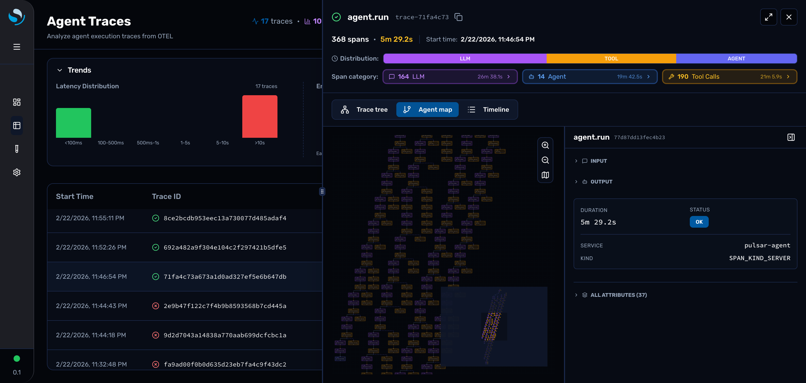
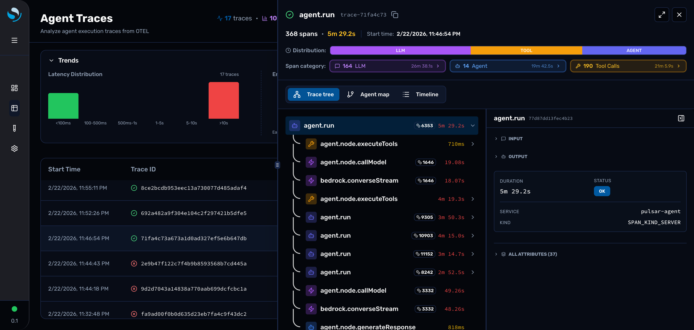
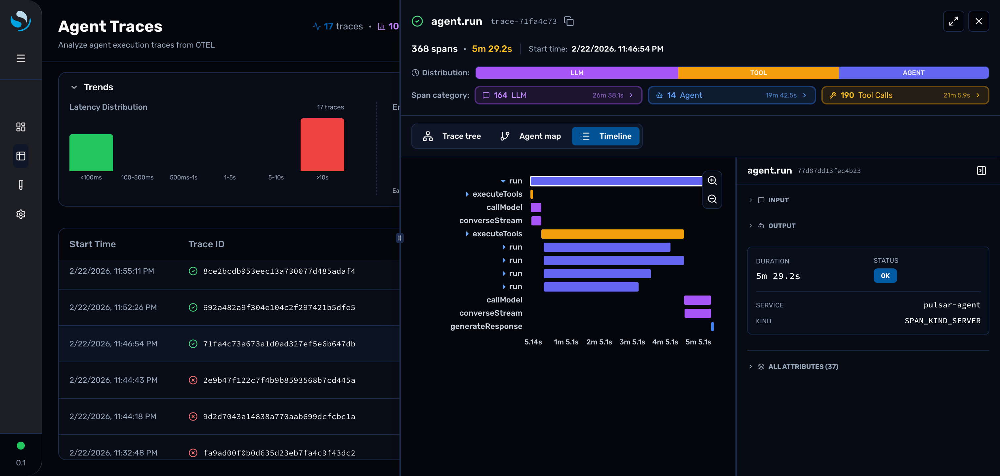

# Agent Traces UI Improvements: Flyout Behavior & Layout Enhancements

## Overview
This PR introduces significant improvements to the Agent Traces UI, focusing on trace flyout behavior, layout consistency, and user experience enhancements.

## Key Features

### 1. Enhanced Trace Flyout with Resizable Panels
- **Resizable Split View**: Implemented EUI's resizable panels for the trace flyout, allowing users to adjust the view between trace list and detail panels
- **Minimap Toggle**: Added a toggle button to show/hide the minimap in the Agent Map visualization
- **Improved Layout**: Better space utilization with collapsible panels

### 2. Multiple Visualization Tabs
The trace flyout now supports three visualization modes:
- **Agent Map**: Interactive graph visualization showing agent execution flow
- **Trace Tree**: Hierarchical tree view of spans
- **Timeline**: Temporal visualization of trace execution

### 3. Fullscreen Mode Improvements
- **State Preservation**: Fullscreen mode now properly preserves selected trace and tab state
- **Click-Outside Detection**: Fixed click-outside behavior to prevent unintended flyout closure
- **Smooth Transitions**: Enhanced animations and transitions between normal and fullscreen modes

### 4. Benchmark Traces Tab Layout Fix
- **Default View Mode**: Fixed the default view to show "Traces" instead of "Benchmarks"
- **Layout Consistency**: Improved responsive layout for the benchmark traces tab
- **State Management**: Better handling of view mode state across component lifecycle

### 5. WCAG Color Compliance
- **Accessibility**: Updated color schemes to meet WCAG 2.1 Level AA standards
- **Badge Colors**: Improved contrast ratios for status badges and indicators
- **Documentation**: Added comprehensive color compliance documentation

## Technical Changes

### Components Modified
- `TraceFlyoutContent.tsx`: Added resizable panels and minimap toggle
- `TraceInfoView.tsx`: Enhanced trace detail view with better layout
- `AgentTracesPage.tsx`: Improved state management and view mode handling
- `traces_tree_view.tsx`: Fixed layout issues in benchmark traces tab

### New Features
- Resizable panel implementation using EUI components
- Minimap visibility toggle with state persistence
- Enhanced fullscreen mode with proper state synchronization
- Improved click-outside detection logic

### Bug Fixes
- Fixed benchmark traces tab default view mode
- Resolved click-outside detection issues in flyout
- Fixed state preservation in fullscreen mode
- Improved responsive layout handling

## Testing
- ✅ Manual testing completed for all flyout interactions
- ✅ Fullscreen mode state preservation verified
- ✅ Responsive layout tested across different screen sizes
- ✅ WCAG color compliance validated
- ✅ Click-outside behavior tested in various scenarios

## Documentation
- Added comprehensive design specs in `.kiro/specs/`
- Updated implementation summaries
- Added WCAG color compliance documentation
- Included visual testing checklist

## Breaking Changes
None. All changes are backward compatible.

## Related Issues
- Fixes trace flyout layout inconsistencies
- Improves user experience with resizable panels
- Addresses accessibility concerns with WCAG compliance

## Screenshots
See the `pr-screenshots/` directory for detailed visual documentation of the changes.
