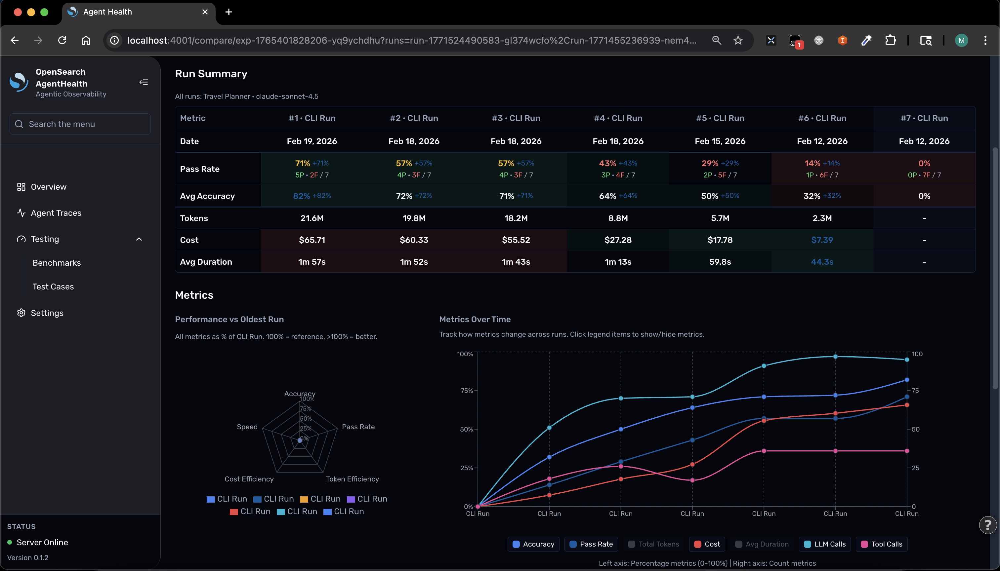
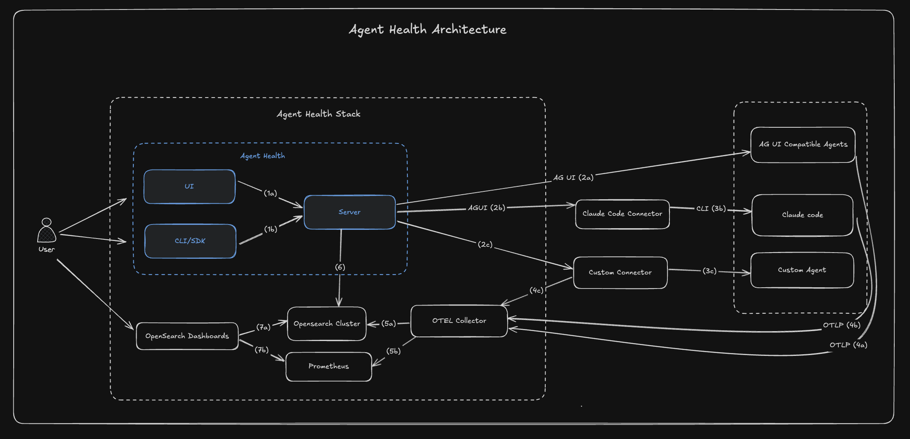

<h1 align="center" style="border-bottom: none">
    <div>
        <a href="https://opensearch.org">
            
        </a>
        <br>
        Agent Health
    </div>
</h1>

<h2 align="center" style="border-bottom: none">Open-source AI Agent Evaluation & Observability</h2>

<p align="center">
Agent Health helps you evaluate, monitor, and optimize AI agents. From autonomous RCA agents to coding assistants, it provides real-time execution streaming, LLM-based evaluation with trajectory comparison, batch experiments, and deep observability through OpenTelemetry traces — all backed by OpenSearch.
</p>

<div align="center">

[](LICENSE.txt)
[](https://www.npmjs.com/package/@opensearch-project/agent-health)
[](https://github.com/opensearch-project/agent-health/actions/workflows/ci.yml)

</div>

<p align="center">
    <a href="https://opensearch.org"><b>Website</b></a> &bull;
    <a href="https://opensearch.org/slack.html"><b>Slack</b></a> &bull;
    <a href="https://x.com/OpenSearchProj"><b>Twitter/X</b></a> &bull;
    <a href="https://www.youtube.com/watch?v=MU3tTv4lKtc"><b>Demo Video</b></a> &bull;
    <a href="https://observability.opensearch.org/docs/agent-health/"><b>Documentation</b></a> &bull;
    <a href="CHANGELOG.md"><b>Changelog</b></a>
</p>

<div align="center" style="margin-top: 1em; margin-bottom: 1em;">
<a href="#what-is-agent-health">What is Agent Health?</a> &bull;
<a href="#installation">Installation</a> &bull;
<a href="#features">Features</a> &bull;
<a href="#quick-configuration">Configuration</a> &bull;
<a href="#contributing">Contributing</a>
</div>

<br>

<p align="center">
    <a href="screenshots/Comparison.png">
        
    </a>
</p>

<p align="center">
    <i>Side-by-side comparison of agent evaluation runs with pass rate, accuracy, cost, and performance metrics over time.</i>
</p>

---

<a id="what-is-agent-health"></a>
## What is Agent Health?

Agent Health is an evaluation and observability framework for AI agents, built on [OpenSearch](https://opensearch.org). It helps you measure agent performance through **"Golden Path" trajectory comparison** — where an LLM judge evaluates agent actions against expected outcomes — and provides deep observability into agent execution via OpenTelemetry traces.

**Who uses Agent Health:**
- AI teams building autonomous agents (RCA, customer support, data analysis)
- QA engineers testing agent behavior across scenarios
- Platform teams monitoring agent performance in production
- Developers using AI coding agents who want visibility into usage, costs, and productivity

> **See it in action:** Watch the [demo video on YouTube](https://www.youtube.com/watch?v=MU3tTv4lKtc)

---

<a id="installation"></a>
## Installation

Get Agent Health running in minutes. Choose the option that best suits your needs:

### Option 1: NPX (Fastest — No Setup)

```bash
# Start Agent Health with demo data (no configuration needed)
npx @opensearch-project/agent-health
```

Opens http://localhost:4001 with pre-loaded sample data for exploration.

### Option 2: Docker Compose (with OpenSearch Observability Stack)

For the full observability stack with OpenSearch, OpenTelemetry Collector, and Data Prepper for trace ingestion:

```bash
# Clone the repository
git clone https://github.com/opensearch-project/agent-health.git
cd agent-health

# Start the OpenSearch observability stack
docker compose up -d

# Copy Docker environment configuration
cp .env.docker .env

# Start Agent Health (connects to local OpenSearch automatically)
npx @opensearch-project/agent-health
```

This brings up:
- **OpenSearch** — Stores traces, test cases, benchmarks, and evaluation results
- **OpenTelemetry Collector** — Receives telemetry data via OTLP (ports 4317/4318)
- **Data Prepper** — Transforms and enriches traces before OpenSearch ingestion

> **Prerequisites:** Docker Desktop with 4GB+ memory allocated. See [docker-compose.yml](./docker-compose.yml) for configuration options.

### Next Steps

- [Getting Started Guide](./GETTING_STARTED.md) — Step-by-step walkthrough from install to first evaluation
- [Configuration Guide](./docs/CONFIGURATION.md) — Connect your own agent and configure the environment
- [CLI Reference](./docs/CLI.md) — Full command-line documentation

---

<a id="features"></a>
## Features

### Agent Evaluation & Observability

| Feature | Description |
|---------|-------------|
| **Evals** | Real-time agent evaluation with trajectory streaming |
| **Experiments** | Batch evaluation runs with configurable parameters |
| **Compare** | Side-by-side trace comparison with aligned and merged views |
| **Agent Traces** | Table-based trace view with latency histogram, filtering, and detailed flyout |
| **Live Traces** | Real-time trace monitoring with auto-refresh and filtering |
| **Trace Views** | Timeline and Flow visualizations for debugging |
| **Reports** | Evaluation reports with LLM judge reasoning |
| **Connectors** | Pluggable protocol adapters (AG-UI SSE, REST, CLI, Claude Code) |

### Coding Agent Analytics

A unified dashboard for monitoring AI coding agent usage across **Claude Code**, **Kiro**, and **Codex CLI**. Zero configuration — just run `agent-health` and it auto-detects installed agents.

- **Multi-agent dashboard**: Session history, cost estimation, tool usage, activity patterns, and efficiency metrics
- **9 analytics tabs**: Overview, Sessions, Projects, Costs, Activity, Efficiency, Tools, Advanced, and Workspace management
- **Interactive drill-downs**: Click any chart, card, or metric to drill into filtered session views
- **Workspace management**: View and edit Claude Code memory files, plans, tasks; browse Kiro MCP servers, agents, and extensions
- **Privacy-first**: All data stays local — reads directly from `~/.claude/`, `~/.kiro/`, `~/.codex/`

[Full Coding Agent Analytics documentation](./docs/CODING_AGENT_ANALYTICS.md)

### Supported Connectors

| Connector | Protocol | Description |
|-----------|----------|-------------|
| `agui-streaming` | AG-UI SSE | ML-Commons agents (default) |
| `rest` | HTTP POST | Non-streaming REST APIs |
| `subprocess` | CLI | Command-line tools |
| `claude-code` | Claude CLI | Claude Code agent comparison |
| `mock` | In-memory | Demo and testing |

For creating custom connectors, see [docs/CONNECTORS.md](./docs/CONNECTORS.md).

### Observio Sample Agent

Agent Health includes **Observio**, a reference ReAct agent you can use as a practice target for evaluating and improving agent performance:

```bash
cd observio-sample-agent && npm install && npm run start:ag-ui
npx @opensearch-project/agent-health run -t demo-otel-001 -a observio
```

See the [Observio README](./observio-sample-agent/README.md) for details.

---

<a id="architecture"></a>
## Architecture

<p align="center">
    
</p>

Agent Health uses a client-server architecture where all clients (UI, CLI) access OpenSearch through a unified HTTP API. The server handles agent communication via pluggable connectors and proxies LLM judge calls to AWS Bedrock.

For detailed architecture documentation, see [docs/ARCHITECTURE.md](./docs/ARCHITECTURE.md).

---

<a id="quick-configuration"></a>
## Quick Configuration

Agent Health works out-of-the-box with demo data. Configure when you're ready to connect your own agent:

```bash
# Generate a config file with examples
npx @opensearch-project/agent-health init
```

```typescript
// agent-health.config.ts
export default {
  agents: [
    {
      key: "my-agent",
      name: "My Agent",
      endpoint: "http://localhost:8000/agent",
      connectorType: "rest",  // or "agui-streaming", "subprocess"
      models: ["claude-sonnet-4"],
      useTraces: true,        // Enable OpenTelemetry trace collection
    }
  ],
};
```

> **Tip:** Run `npx @opensearch-project/agent-health doctor` to verify your configuration is loaded correctly.

For full configuration options including authentication hooks and environment variables, see [CONFIGURATION.md](./docs/CONFIGURATION.md).

---

<a id="star-history"></a>
## Star History

If you find Agent Health useful, please consider giving us a star! Your support helps us grow our community and continue improving the project.

[](https://github.com/opensearch-project/agent-health)

---

<a id="contributing"></a>
## Contributing

We welcome contributions! There are many ways to get involved:

- [Report a Bug](https://github.com/opensearch-project/agent-health/issues/new/choose) — Found something broken? Let us know
- [Request a Feature](https://github.com/opensearch-project/agent-health/issues/new/choose) — Have an idea? We'd love to hear it
- [Submit a Pull Request](https://github.com/opensearch-project/agent-health/pulls) — Code contributions are always welcome
- [Join the Discussion](https://opensearch.org/slack.html) — Chat with us on the OpenSearch Slack

### Development Quick Start

```bash
git clone https://github.com/opensearch-project/agent-health.git
cd agent-health
npm install
npm run dev          # Frontend on port 4000
npm run dev:server   # Backend on port 4001
```

All commits require DCO signoff (`git commit -s`) and all PRs must pass CI checks.

For detailed development setup, testing, CI pipeline, debugging, and troubleshooting, see the [Developer Guide](./DEVELOPER_GUIDE.md). For full contribution guidelines, see [CONTRIBUTING.md](./CONTRIBUTING.md).

---

## Documentation

| Guide | Description |
|-------|-------------|
| [Getting Started](./GETTING_STARTED.md) | Step-by-step walkthrough from install to first evaluation |
| [Configuration](./docs/CONFIGURATION.md) | Connect your agent and configure the environment |
| [CLI Reference](./docs/CLI.md) | Command-line interface documentation |
| [Coding Agent Analytics](./docs/CODING_AGENT_ANALYTICS.md) | Multi-agent dashboard and remote server monitoring |
| [Observio Sample Agent](./observio-sample-agent/) | Reference agent for practicing evaluations |
| [Developer Guide](./DEVELOPER_GUIDE.md) | Development setup, testing, CI, debugging |
| [Connectors Guide](./docs/CONNECTORS.md) | Create custom connectors for your agent type |
| [Architecture](./docs/ARCHITECTURE.md) | System design and patterns |
| [ML-Commons Setup](./docs/ML-COMMONS-SETUP.md) | OpenSearch ML-Commons integration |

---

<p align="center">
    Made with care by the <a href="https://opensearch.org">OpenSearch</a> community
</p>
